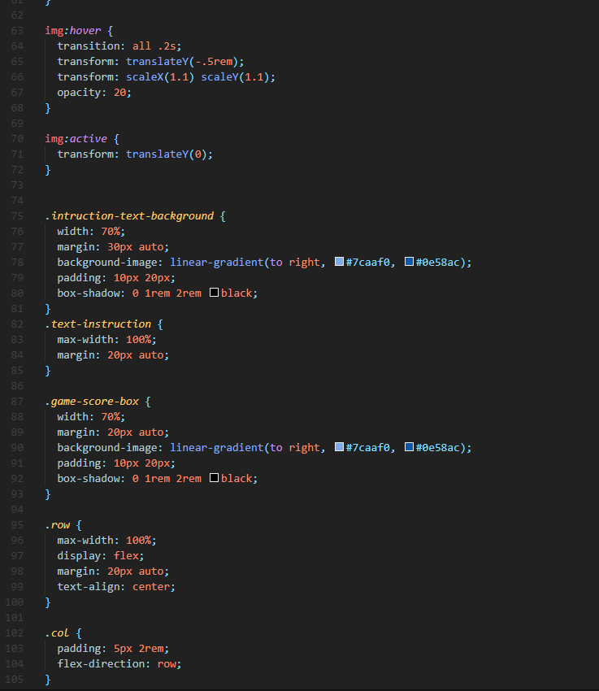
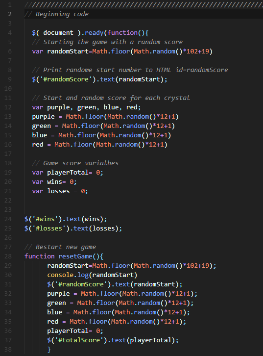
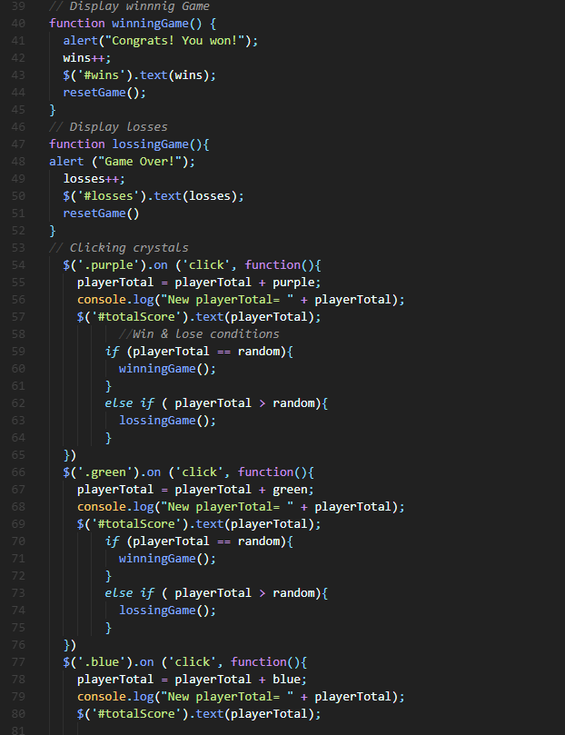
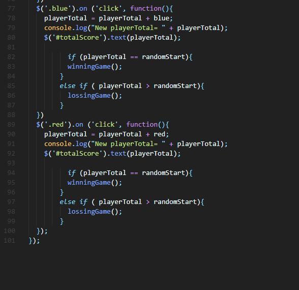
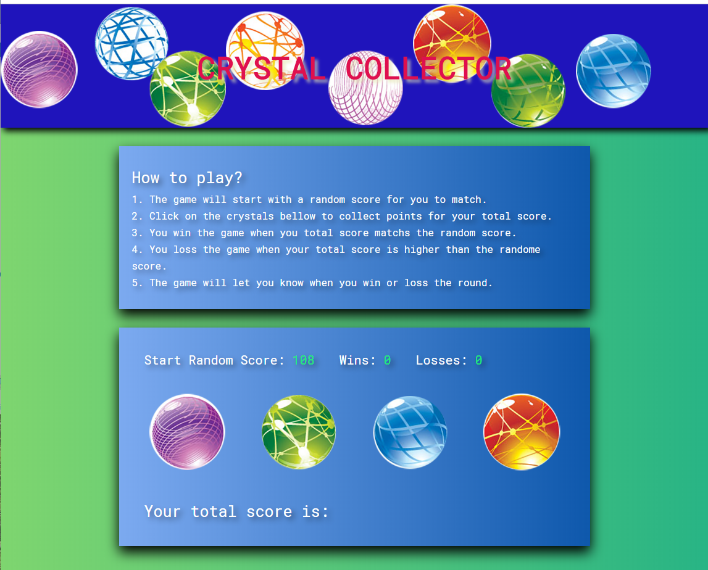
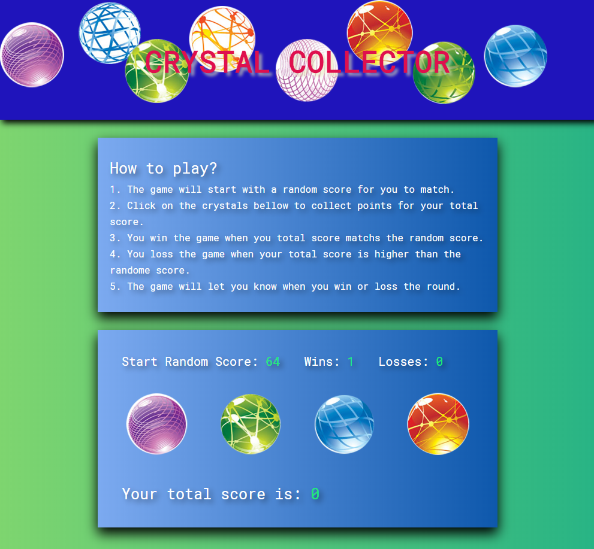

# unit-4-game

## Crystal Collection Game
The goal for the assignment is the create an interactive fun game for the web browsers, the app will be able to dynamically update the HTML page with game computer generated game score, user wins, losses and total game score using Javascript and JQuery DOM manipulation library, the tool using for this project is HTML, CSS, Javascript and JQuery.

## Technology Used
HTML, CSS, JavaScript, & JQuery

## Version Control
GIT & GITHUB

## Game rules
<h2>How to play?</h2>

1. The game will start with a random score for you to match.

2. Click on the crystals bellow to collect points for your total score.

3. You win the game when you total score matchs the random score.

4. You loss the game when your total score is higher than the randome score.

5. The game will let you know when you win or loss the round.

## Homework Assignment Instruction
[jQuery Assignment - Intruction](https://ucb.bootcampcontent.com/UCB-Coding-Bootcamp/UCB-VIRT-FSF-PT-09-2019-U-O/blob/master/course-content/04-jquery/homework/Instructions/homework_instructions.md)

## Start the Game
[Click here to start](https://monksedo.github.io/unit-4-game/)

## CSS Code Snippets

## JavaScrip Code 01

## JavaScrip Code 02

## JavaScrip Code 03

## App Screen 01

## App Screen 02

